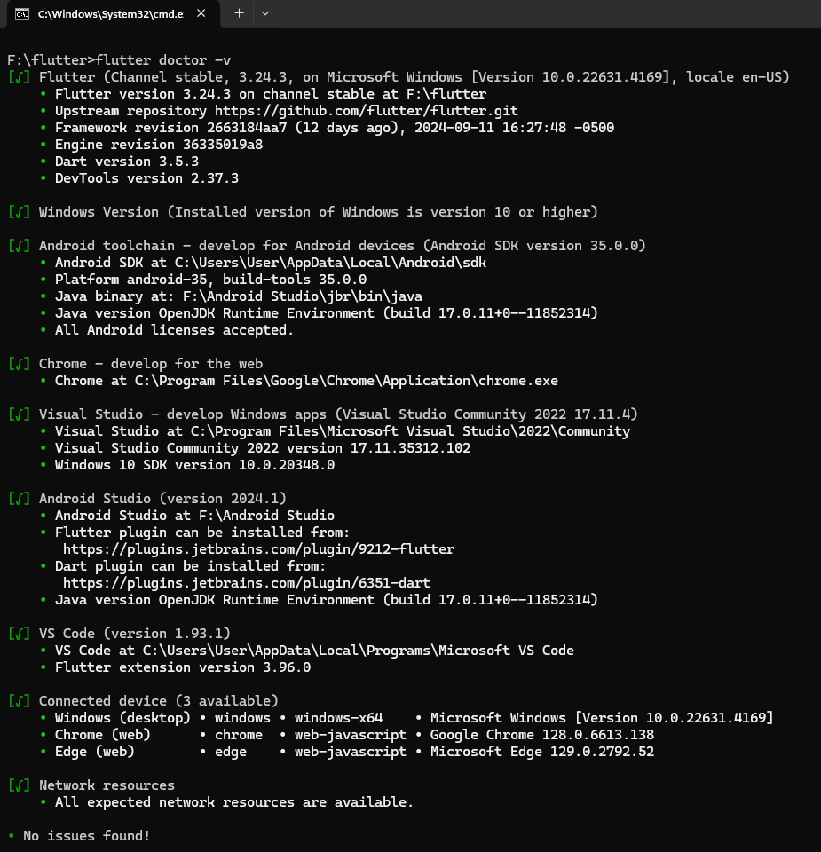
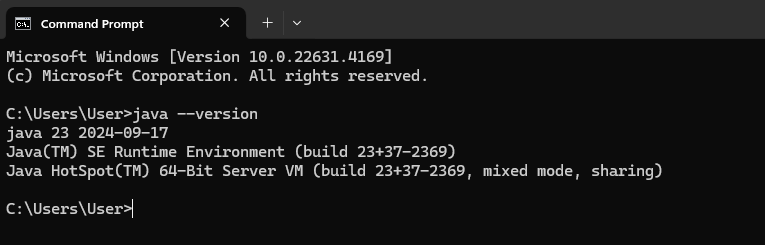
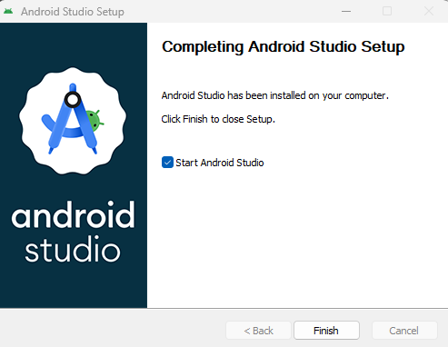
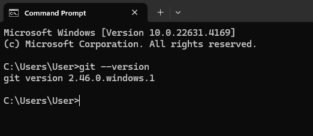
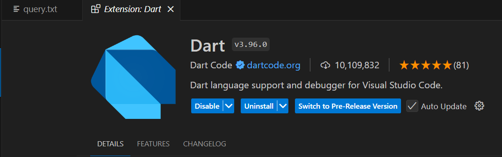
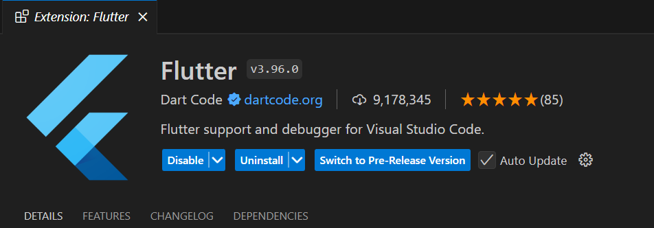

## PPB_FRIDO AFRIYANTO_2211104088_SE-06-02/01_Running-Modul/LP_01

<li> Nama   : Frido Afriyanto
<li> NIM    : 2211104088
<li> Kelas  : SE-06-02

# screenshot flutter sudah terinstall
<li> screenshot flutter sudah terinstall

# JDK Terinstall
<li> Screenshot jdk lewat cmd

# Bukti Install Android Studio
<li> Screenshot android studio sudah terinstall

# Git Terinstall
<li> Screenshot bukti terinstall git melalui cmd

# Installasi Extensions pada visual studio code
<li> Screenshot visual studio code dan extensions "Dart" juga "Flutter"

 

