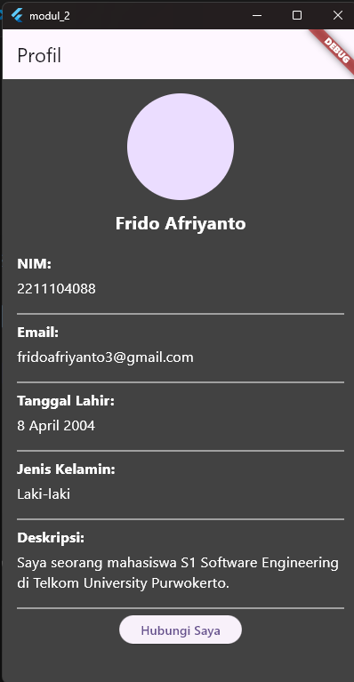

# PPB_Frido_Afriyanto_2211104088_SE-06-02/02_Pengenalan-Flutter/LP_02

- **Nama**: Frido Afriyanto
- **NIM**: 2211104088
- **Kelas**: SE-06-02

## 1. Jelaskan apa itu Dart & Flutter beserta contoh widget yang ada pada Flutter.

- **Dart** adalah bahasa pemrograman yang dikembangkan oleh Google. Dart dirancang untuk pengembangan aplikasi yang cepat, efisien, dan berkinerja tinggi, khususnya pada platform web, mobile, dan desktop. Dart memiliki sintaks yang mirip dengan C, sehingga mudah dipelajari oleh programmer yang sudah familiar dengan bahasa seperti JavaScript, C++, atau Java. Bahasa ini mendukung berbagai fitur modern, seperti asynchronous programming (pengelolaan operasi yang tidak sinkron) dan strong typing (tipe data yang ketat), yang membuatnya sangat cocok untuk pengembangan aplikasi berskala besar.

- **Flutter** adalah framework yang juga dikembangkan oleh Google untuk membuat aplikasi natively compiled yang dapat berjalan di Android, iOS, web, dan desktop. Flutter menggunakan Dart sebagai bahasa pemrogramannya. Keunikan Flutter adalah kemampuannya untuk memberikan tampilan antarmuka pengguna (UI) yang indah dan performa tinggi dengan single codebase (satu basis kode). Artinya, satu kode bisa digunakan untuk beberapa platform berbeda. Flutter memiliki berbagai widget yang membantu membangun UI yang dinamis, interaktif, dan responsif.

## 2. Buatlah sebuah project Flutter.

## 3. Setelah project dibuat, jalankan di emulator atau pada real device. Jika tampilan project Flutter muncul seperti gambar di bawah ini, maka project telah berhasil dijalankan.

## 4. Setelah berhasil, modifikasi halaman di atas untuk menampilkan biodata kalian, minimal 5 widget!! (bebas, buatlah sekreatif mungkin).

